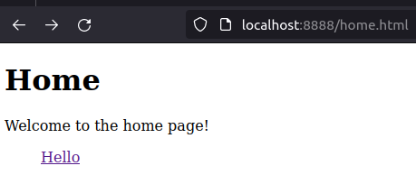

# HTTP Server in Python
Implementation of a basic HTTP server written in Python using the Python sockets API

## Usage
For localhost:  
Run each line in a seperate terminal in order
```
$ python server.py
$ python client.py

# In the terminal running server.py, you will see
Listening for connections at  ('127.0.0.1', 8888)
Connected received from:  ('127.0.0.1', 46772)
Received data:  b'Hello, world!'
```
  
For two separate machines  
```
machine 1: $ python server.py --host custom
machine 2: $ python client.py --host custom
```

To navigate to a webpage use run `python server.py` and instead of using client.py just use a web browswer and go to the URL [localhost:8888](localhost:8888) after starting server.py (if this fails go directly to [127.0.0.1:8888](127.0.0.1))
```
$ python server.py
# in your web browser go to
localhost:8888/home.html

Terminal output:
Request received:  ['GET', '/home.html', 'HTTP/1.1\r']
Connected received from:  ('127.0.0.1', 60328)
Received data:  GET /hello.html HTTP/1.1
Host: localhost:8888
    bunch of other stuff describing the HTTP request from firefox
```
Browser output:  


## Requirements
`Python >= 3.5`
  
## Todo
- Allow for multiple clients. Make 2 versions, 1 multi-threaded or multi-processed and the other event drive i.e. async
- Allow for serving large files using chunking

## Resources
* [Writing an HTTP server from scratch in Python](https://bhch.github.io/posts/2017/11/writing-an-http-server-from-scratch/)
* [Python Socket Documentation](https://docs.python.org/3/library/socket.html)
* [Mozilla Docs - HTTP Messages](https://developer.mozilla.org/en-US/docs/Web/HTTP/Messages)
* [Personal Notes](https://personalmicrosoftsoftware0-my.sharepoint.com/:w:/g/personal/hershey890_personalmicrosoftsoftware_ucla_edu/EQhKXeENeG5Cod4ZIlfMYlABsHXum5AN2TOlnL__zyaLOg?e=QBQX6d)